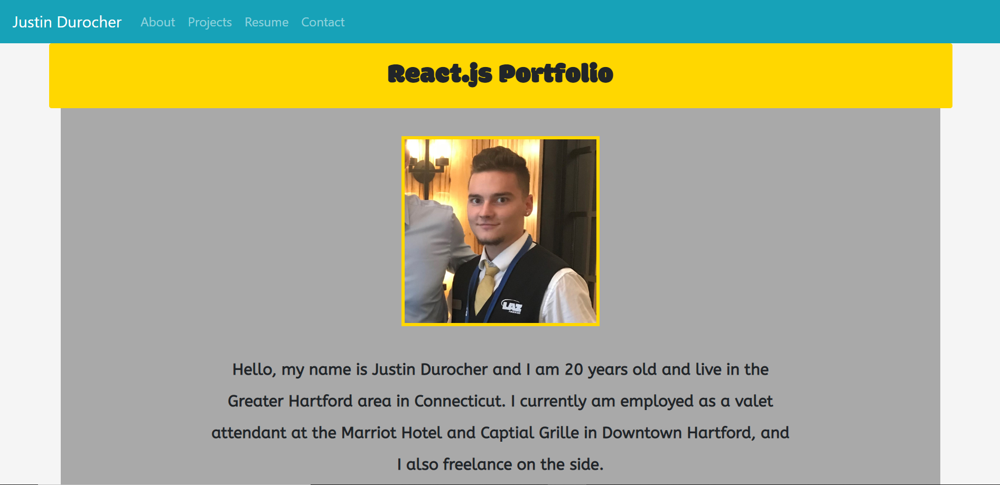
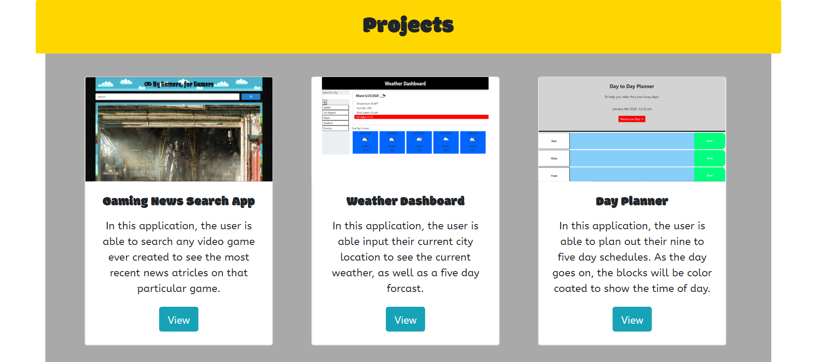
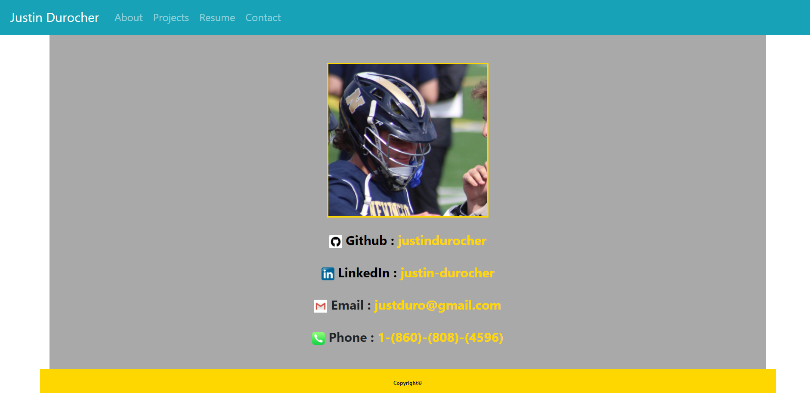

# React-Portfolio

<h3><---------- Laptop and Mobile Use ----------></h3>
  
<h3>https://justindurocherfullstack.herokuapp.com

<h1>Installation</h1>
    

With creating this application, I used npx create-react-app and finished downloading all of the left out dependencies. Using react-bootstrap I was able to create all of the front-end pages needed. A home page, projects, and contact page are created, as well as a seperate tab with a relative path to my resume. For the backend, I used javascript as well as react-animations to add different effects to all the components on the page. After creating the application, I used Heroku to host and serve the page to the internet.

<h1>Usage</h1>

The purpose of this application is for myself as a full stack web developer, to show off my recent and most accomplished projects that I have created through the years of me learning how to code.

  

<h3>Technologies Used</h3>

<ul>
  <li>HTML5</li>
  <li>CSS3</li>
  <li>React Bootstrap</li>
  <li>React Animations</li>
  <li>React</li>
  <li>Node</li>
  <li>WebPack</li>
  <li>TinyPng</li>
  <li>NPM & NPX</li>
</ul>

<h1>Contributors</h1>

<h3>Frontend and Backend</h3>
<ul>
    <li>Github: justindurocher </li>
</ul>
<h1>Credits</h1>
<ul>
    <li>www.youtube.com</li>
    <li>www.github.com</li>
    <li>www.gitlab.com</li>
    <li>www.google.com</li>
    <li>www.stackoverflow.com</li>
    <li>Visual Studio Code</li>
</ul>

